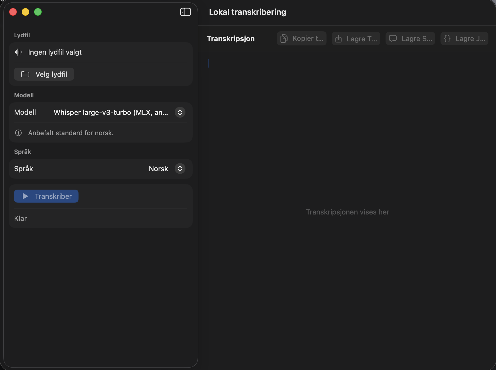

# Local Transcriber

Local Transcriber is a small native macOS app for offline audio transcription. It runs local command-line transcription tools from a SwiftUI interface and does not send audio or transcript text to external APIs.

The app is currently Norwegian-first, with MLX Whisper as the recommended default for Norwegian speech.



## Features

- Native SwiftUI macOS app.
- Pick an audio or video file from Finder.
- Transcribe locally with `mlx_whisper` or `canary-transcribe`.
- Save plain text output.
- Save generated SRT and JSON output when the selected backend produces it.
- Offline execution environment for Hugging Face tooling:
  - `HF_HUB_OFFLINE=1`
  - `TRANSFORMERS_OFFLINE=1`
  - `HF_HUB_DISABLE_TELEMETRY=1`

## Requirements

- macOS 14 or newer.
- Swift toolchain compatible with SwiftPM `swift-tools-version: 6.3`.
- Local transcription tools available in `PATH`:
  - `mlx_whisper`
  - `canary-transcribe`
- The model files needed by those tools must already be downloaded locally.

The app intentionally does not download models at runtime. If a required local model is missing, the underlying tool will fail instead of silently using the network.

## Recommended Local Setup

Install or verify MLX Whisper:

```bash
uvx --python 3.12 --from mlx-whisper mlx_whisper --help
```

Download the recommended MLX Whisper model with your preferred Hugging Face tooling:

```bash
uvx --from huggingface_hub hf download mlx-community/whisper-large-v3-turbo
```

Optional Canary backend:

```bash
canary-transcribe --help
```

The Canary backend expects the `nvidia/canary-1b-v2` model to be available locally through the tool's own setup.

## Run

```bash
git clone https://github.com/bjorkepoc/local-transcriber.git
cd local-transcriber
./script/build_and_run.sh
```

Verify that the app builds and launches:

```bash
./script/build_and_run.sh --verify
```

Run tests:

```bash
swift test
```

## Supported Models

### Whisper large-v3-turbo via MLX

- Model: `mlx-community/whisper-large-v3-turbo`
- Tool: `mlx_whisper`
- Recommended default for Norwegian.
- Uses `--language no` when Norwegian is selected.
- Runs with `--output-format all`, allowing the app to save TXT, SRT, and JSON output.

### NVIDIA Canary 1B v2

- Model: `nvidia/canary-1b-v2`
- Tool: `canary-transcribe`
- Runs locally.
- Included as an alternative backend.
- Marked in the app as not recommended for Norwegian.
- Current app integration saves text from stdout as TXT.

## Architecture

This is a simple Swift Package Manager macOS app:

- `Sources/LocalTranscriber/App` contains the app entry point.
- `Sources/LocalTranscriber/Views` contains the SwiftUI UI.
- `Sources/LocalTranscriber/ViewModels` coordinates UI state and save/copy actions.
- `Sources/LocalTranscriber/Services` runs local transcription processes.
- `Sources/LocalTranscriber/TranscriptionTypes.swift` defines models, languages, and result types.
- `Tests/LocalTranscriberTests` covers argument construction and model/language behavior.

The app uses `Process` to launch local command-line tools. Each MLX Whisper run writes into a temporary output directory; the app reads the generated files back into memory and removes the temporary directory afterward.

## Privacy

Local Transcriber is designed for local-first transcription:

- No app server.
- No API key.
- No audio upload.
- No transcript upload.
- No automatic model downloads from the app process.

You are still responsible for how the external tools installed on your machine are configured. The app sets offline environment variables for the child processes it starts.

## Current Limitations

- No packaged release artifact yet; build from source with SwiftPM.
- No automatic dependency installation.
- No transcript history or project library.
- UI copy is currently Norwegian.
- Canary output support is text-only in the app.

## Contributing

Issues and pull requests are welcome. Useful contributions include:

- Better setup documentation for different Mac configurations.
- More robust error messages for missing tools or models.
- Packaged release builds.
- Additional local transcription backends.
- English UI localization.

Please keep the project local-first. Features that require uploading audio or transcript data should be optional and explicit.

## License

MIT. See [LICENSE](LICENSE).
